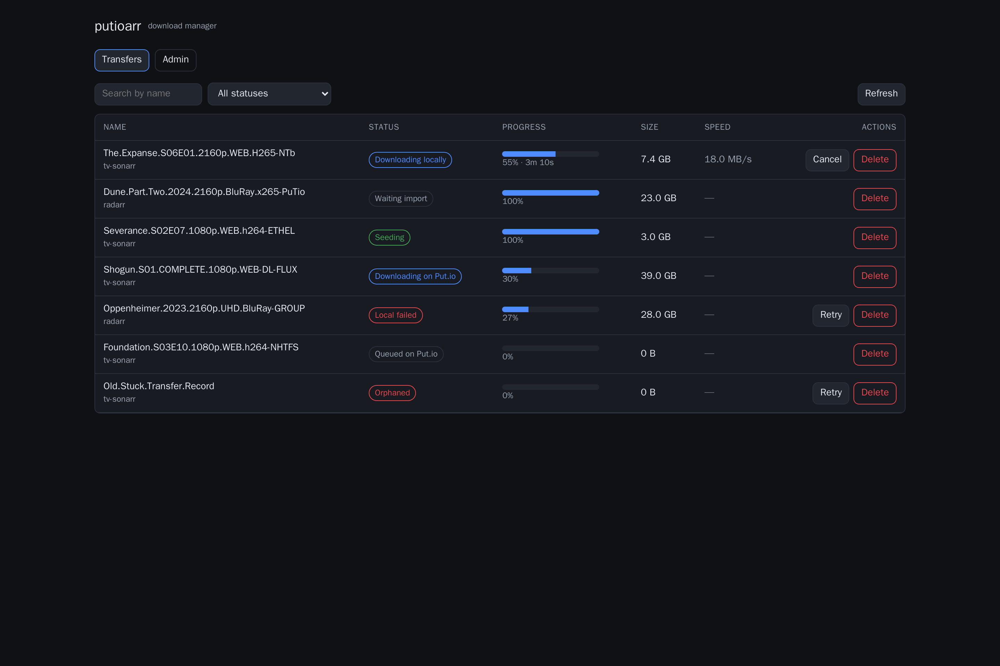
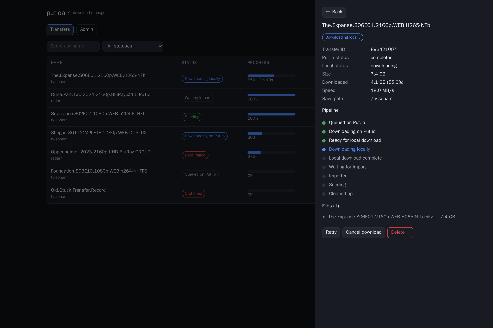
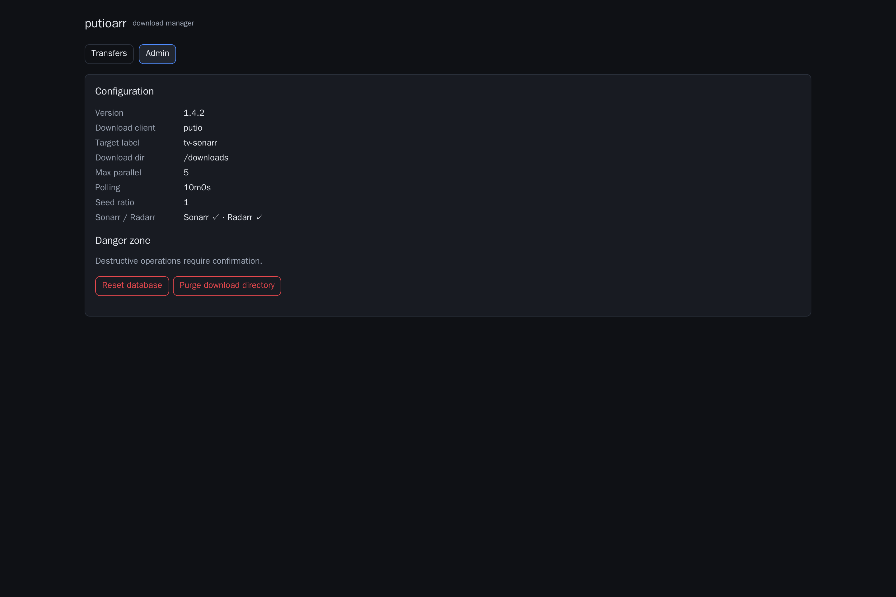

<div align="center">

# Seedbox Downloader

**Automated media pipeline that bridges your seedbox with Sonarr, Radarr, and other *Arr applications.**


[Getting Started](#getting-started) | [Configuration](#configuration) | [Put.io + *Arr Setup](#putio--arr-integration) | [Web UI](#web-ui) | [Monitoring](#monitoring) | [Contributing](#contributing)

</div>

---

> **Disclaimer** — This project is provided for educational and legal use only. The author does **not** incentivize, condone, or support piracy or the illegal downloading, sharing, or distribution of copyrighted material. It is your responsibility to ensure compliance with all applicable laws in your jurisdiction.

## What is this?

Seedbox Downloader is an event-driven Go service that automatically downloads completed torrents from your seedbox and integrates with the *Arr ecosystem. It supports **Deluge** and **Put.io** as seedbox providers, with a built-in **Transmission RPC proxy** so Sonarr and Radarr treat it like a native download client.

### Key Features

- **Dual seedbox support** — Deluge (JSON-RPC) and Put.io (OAuth2 API)
- **Transmission RPC proxy** — *Arr apps see it as a Transmission client, no extra config needed
- **Web UI** — Browser dashboard to monitor, retry, cancel, and remove transfers, plus admin actions
- **Automatic import detection** — Monitors Sonarr/Radarr until files are imported, then cleans up
- **Seed ratio enforcement** — Optionally wait for a target seed ratio before removing transfers
- **Parallel downloads** — Configurable concurrency with progress tracking
- **Discord notifications** — Rich embeds for download events, failures, and missing transfers
- **Full observability** — OpenTelemetry traces, Prometheus metrics, Grafana dashboards included
- **SQLite state tracking** — Atomic transfer claiming prevents duplicate processing
- **Distroless Docker image** — Minimal, secure, non-root container

## How It Works

```
                    ┌──────────────┐
                    │  Seedbox     │
                    │ (Deluge /    │
                    │  Put.io)     │
                    └──────┬───────┘
                           │ poll for tagged transfers
                           ▼
┌────────────┐    ┌────────────────┐    ┌──────────────┐
│  Sonarr /  │◄──►│   Seedbox      │───►│   SQLite DB  │
│  Radarr    │    │   Downloader   │    │  (state)     │
│  (*Arr)    │    │                │    └──────────────┘
└────────────┘    │  - Download    │
   ▲  Transmission│  - Track       │    ┌──────────────┐
   │  RPC proxy   │  - Import mon. │───►│   Discord     │
   └──────────────│  - Cleanup     │    │  (webhooks)   │
                  └────────┬───────┘    └──────────────┘
                           │
                           ▼
                    ┌──────────────┐
                    │  /downloads  │
                    │  (local fs)  │
                    └──────────────┘
```

**Pipeline flow:**
1. Polls seedbox for torrents matching a label/tag
2. Claims transfers atomically in SQLite (safe for multiple instances)
3. Downloads files in parallel to local storage
4. Monitors *Arr APIs until import is confirmed
5. Waits for seed ratio threshold (if configured)
6. Cleans up transfer from seedbox and local storage
7. Sends Discord notifications at each stage

## Getting Started

### Docker (recommended)

**Deluge mode:**

```sh
docker run --rm \
  -e DOWNLOAD_CLIENT=deluge \
  -e DELUGE_BASE_URL=https://your-deluge-server \
  -e DELUGE_API_URL_PATH=/deluge/json \
  -e DELUGE_USERNAME=admin \
  -e DELUGE_PASSWORD=secret \
  -e TARGET_LABEL=sonarr \
  -e DOWNLOAD_DIR=/downloads \
  -v /path/to/downloads:/downloads \
  jackcoelho/putioarr:latest
```

**Put.io mode:**

```sh
docker run --rm -p 9091:9091 \
  -e DOWNLOAD_CLIENT=putio \
  -e PUTIO_TOKEN=your-token \
  -e PUTIO_BASE_DIR=/downloads \
  -e TARGET_LABEL=sonarr \
  -e DOWNLOAD_DIR=/downloads \
  -e TRANSMISSION_USERNAME=admin \
  -e TRANSMISSION_PASSWORD=secret \
  -v /path/to/downloads:/downloads \
  jackcoelho/putioarr:latest
```

### Build from source

```sh
git clone https://github.com/fcjack/putioarr.git
cd putioarr
go build -o seedbox_downloader ./cmd/seedbox_downloader
./seedbox_downloader
```

> Requires Go 1.26+ and CGO enabled (for SQLite).

## Docker Compose

```yaml
services:
  seedbox_downloader:
    image: jackcoelho/putioarr:latest
    container_name: seedbox_downloader
    environment:
      DOWNLOAD_CLIENT: "putio"
      PUTIO_TOKEN: "your-putio-token"
      PUTIO_BASE_DIR: "/downloads"
      TARGET_LABEL: "sonarr"
      DOWNLOAD_DIR: "/downloads"
      KEEP_DOWNLOADED_FOR: "168h"
      TRANSMISSION_USERNAME: "admin"
      TRANSMISSION_PASSWORD: "secret"
      WEB_BIND_ADDRESS: "0.0.0.0:9091"
      # Web UI dashboard (enabled by default on 9092)
      UI_BIND_ADDRESS: "0.0.0.0:9092"
      # Optional: *Arr integration for import detection
      SONARR_API_KEY: "your-sonarr-api-key"
      SONARR_BASE_URL: "http://sonarr:8989"
      RADARR_API_KEY: "your-radarr-api-key"
      RADARR_BASE_URL: "http://radarr:7878"
      # Optional: notifications
      DISCORD_WEBHOOK_URL: "https://discord.com/api/webhooks/..."
    ports:
      - "9091:9091" # Transmission RPC proxy (for *Arr)
      - "9092:9092" # Web UI dashboard
    volumes:
      - downloads:/downloads
    restart: unless-stopped

volumes:
  downloads:
```

Use a `.env` file to keep secrets out of your compose file. See the [Docker docs](https://docs.docker.com/compose/environment-variables/) for details.

## Configuration

All configuration is done via environment variables.

### Core Settings

| Variable | Default | Description |
|---|---|---|
| `DOWNLOAD_CLIENT` | `deluge` | Seedbox provider: `deluge` or `putio` |
| `DOWNLOAD_DIR` | *required* | Local directory for downloaded files |
| `TARGET_LABEL` | | Label/tag to filter transfers |
| `KEEP_DOWNLOADED_FOR` | `24h` | How long to keep local files before cleanup |
| `POLLING_INTERVAL` | `10m` | How often to poll for new transfers |
| `CLEANUP_INTERVAL` | `10m` | How often to run the cleanup job |
| `MAX_PARALLEL` | `5` | Max concurrent file downloads |
| `LOG_LEVEL` | `INFO` | Log level: `DEBUG`, `INFO`, `WARN`, `ERROR` |
| `DB_PATH` | `downloads.db` | Path to the SQLite database |
| `DISCORD_WEBHOOK_URL` | | Discord webhook for notifications |

### Deluge Settings

| Variable | Description |
|---|---|
| `DELUGE_BASE_URL` | Base URL for the Deluge web UI |
| `DELUGE_API_URL_PATH` | JSON-RPC endpoint path (e.g., `/deluge/json`) |
| `DELUGE_USERNAME` | Deluge web UI username |
| `DELUGE_PASSWORD` | Deluge web UI password |
| `DELUGE_COMPLETED_DIR` | Directory for completed downloads |

### Put.io Settings

| Variable | Default | Description |
|---|---|---|
| `PUTIO_TOKEN` | *required* | Your Put.io OAuth token |
| `PUTIO_BASE_DIR` | *required* | Directory in Put.io for file storage |
| `PUTIO_SEED_RATIO` | `0` | Target seed ratio before cleanup (0 = immediate) |

### Transmission Proxy (for *Arr)

| Variable | Default | Description |
|---|---|---|
| `TRANSMISSION_USERNAME` | *required* | Auth username for the proxy |
| `TRANSMISSION_PASSWORD` | *required* | Auth password for the proxy |
| `WEB_BIND_ADDRESS` | `0.0.0.0:9091` | Proxy listen address |
| `WEB_READ_TIMEOUT` | `30s` | HTTP read timeout |
| `WEB_WRITE_TIMEOUT` | `30s` | HTTP write timeout |
| `WEB_IDLE_TIMEOUT` | `5s` | HTTP idle timeout |
| `WEB_SHUTDOWN_TIMEOUT` | `30s` | Graceful shutdown timeout |

### Web UI

| Variable | Default | Description |
|---|---|---|
| `UI_ENABLED` | `true` | Enable the browser dashboard and its REST API |
| `UI_BIND_ADDRESS` | `0.0.0.0:9092` | Web UI listen address (separate port from the Transmission proxy) |
| `UI_USERNAME` | | Basic-auth username (falls back to `TRANSMISSION_USERNAME`) |
| `UI_PASSWORD` | | Basic-auth password (falls back to `TRANSMISSION_PASSWORD`) |

### *Arr Integration

| Variable | Description |
|---|---|
| `SONARR_API_KEY` | Sonarr API key for import detection |
| `SONARR_BASE_URL` | Sonarr API URL (e.g., `http://sonarr:8989`) |
| `RADARR_API_KEY` | Radarr API key for import detection |
| `RADARR_BASE_URL` | Radarr API URL (e.g., `http://radarr:7878`) |

### Telemetry

| Variable | Default | Description |
|---|---|---|
| `TELEMETRY_ENABLED` | `true` | Enable OpenTelemetry instrumentation |
| `TELEMETRY_OTEL_ADDRESS` | `0.0.0.0:4317` | OTLP gRPC collector address |
| `TELEMETRY_SERVICE_NAME` | `seedbox_downloader` | Service name in traces/metrics |

## Put.io + *Arr Integration

The Transmission RPC proxy lets Sonarr, Radarr, and other *Arr apps use Put.io as if it were a Transmission download client.

### Setup in *Arr

1. Deploy the service with `DOWNLOAD_CLIENT=putio` and the Transmission proxy credentials
2. In your *Arr app, go to **Settings > Download Clients > Add**
3. Select **Transmission** and configure:

| Setting | Value |
|---|---|
| Host | Your server IP/hostname |
| Port | `9091` |
| URL Base | `/transmission` |
| Username | Your `TRANSMISSION_USERNAME` |
| Password | Your `TRANSMISSION_PASSWORD` |
| Category | An existing folder in your Put.io account |

4. Test the connection and save

### Directory Mapping

| Variable | Where | Purpose |
|---|---|---|
| `PUTIO_BASE_DIR` | Put.io cloud | Where files are stored in Put.io |
| `DOWNLOAD_DIR` | Local filesystem | Where files are downloaded to |

Both paths typically point to `/downloads`. *Arr reads from the local `DOWNLOAD_DIR` after files are downloaded.

## Web UI

A built-in browser dashboard gives you visibility and control over the download pipeline — see every transfer's composite status, watch live progress, and recover from failures without touching the database or the filesystem by hand.

It runs as a self-contained single-page app embedded directly in the binary (no extra container or reverse proxy needed) and is served on its **own port**, separate from the Transmission RPC proxy.

### Transfers

The main view lists every transfer with a merged status (Put.io + local download + import state), live progress, size, and speed. Per-row actions adapt to the transfer's state — **Retry** for failed/orphaned items, **Cancel** for in-flight local downloads, and **Delete** for everything.



Selecting a transfer opens a detail drawer with the full pipeline timeline, file list, save path, and any error message, alongside the same actions.



### Admin

The admin tab surfaces the running configuration and a guarded "danger zone" for resetting the state database or purging the download directory. Destructive operations require a short-lived confirmation token, so they can't be triggered by accident or CSRF.



### Enabling & accessing

The Web UI is **enabled by default** on port `9092`. Expose the port and open it in your browser:

```sh
docker run --rm -p 9091:9091 -p 9092:9092 \
  -e DOWNLOAD_CLIENT=putio \
  -e PUTIO_TOKEN=your-token \
  -e PUTIO_BASE_DIR=/downloads \
  -e DOWNLOAD_DIR=/downloads \
  -e TARGET_LABEL=sonarr \
  -e TRANSMISSION_USERNAME=admin \
  -e TRANSMISSION_PASSWORD=secret \
  -v /path/to/downloads:/downloads \
  jackcoelho/putioarr:latest
```

Then visit `http://localhost:9092`.

### Authentication

All Web UI endpoints (including the REST API under `/api/v1`) require **HTTP Basic Auth**. Credentials come from `UI_USERNAME` / `UI_PASSWORD`, falling back to `TRANSMISSION_USERNAME` / `TRANSMISSION_PASSWORD` when the UI-specific variables are unset. If neither is configured, the server logs a warning and access will be denied.

> The UI is intended for use behind your own trusted network or reverse proxy. Always set credentials and use HTTPS when exposing it beyond localhost.

### Disabling

Set `UI_ENABLED=false` to turn the dashboard off entirely; the Transmission RPC proxy is unaffected.

## Monitoring

The project ships with a complete Prometheus + Grafana monitoring stack in the `monitoring/` directory.

```sh
docker compose -f docker-compose.telemetry.yml up -d
```

| Service | URL |
|---|---|
| Grafana | `http://localhost:3000` (admin/admin) |
| Prometheus | `http://localhost:9090` |
| Metrics endpoint | `http://localhost:2112/metrics` |

### Included Metrics

- **RED** — HTTP request rate, error rate, response latency (p95)
- **Business** — Downloads by status, active transfers, download duration, client operations
- **USE** — Memory usage, goroutine count, uptime, error rates by component
- **Database** — Operation rates by type, query duration histograms

See [TELEMETRY.md](TELEMETRY.md) for full details on the instrumentation.

## Project Structure

```
seedbox_downloader/
├── cmd/seedbox_downloader/     # Application entrypoint
├── internal/
│   ├── config/                 # Environment variable loading
│   ├── dc/                     # Download client adapters
│   │   ├── deluge/             #   Deluge JSON-RPC client
│   │   └── putio/              #   Put.io API client
│   ├── downloader/             # Parallel download orchestration
│   │   └── progress/           #   Download progress tracking
│   ├── http/rest/              # Transmission RPC proxy + Web UI REST API
│   ├── http/ui/                # Embedded Vue SPA (go:embed)
│   ├── notifier/               # Discord webhook notifications
│   ├── storage/sqlite/         # SQLite state persistence
│   ├── svc/arr/                # Sonarr/Radarr API clients
│   ├── svc/transfers/          # Web UI read model & actions
│   ├── telemetry/              # OpenTelemetry instrumentation
│   ├── transfer/               # Domain models & orchestrator
│   └── logctx/                 # Structured logging helpers
├── web/                        # Vue 3 + Vite + TypeScript frontend source
├── monitoring/                 # Prometheus + Grafana stack
│   └── grafana/dashboards/     #   Pre-built dashboard
├── Dockerfile                  # Multi-stage distroless build (Node + Go)
├── docker-compose.telemetry.yml
└── .github/workflows/          # CI: lint, test, build, publish
```

## Contributing

Contributions are welcome! Please open an issue first for major changes.

```sh
# Run tests
go test -race ./...

# Run linter
golangci-lint run

# Build the Web UI and embed it, then build the binary
make build-all
```

### Frontend development

The Web UI lives in `web/` (Vue 3 + Vite + TypeScript). For a hot-reloading dev server that proxies the API to a locally running backend:

```sh
cd web
npm install
npm run dev
```

`make frontend` builds the production bundle into `internal/http/ui/dist`, where it is embedded into the Go binary via `go:embed`.

- **Go version:** 1.26+
- **Linter config:** [`.golangci.yml`](.golangci.yml)
- CI runs lint + tests + race detection on every PR

## License

This project is licensed under the MIT License.
